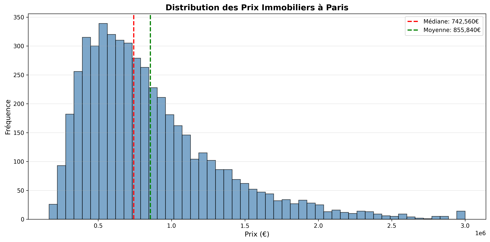

# 🏠 Prédiction des Prix de l'Immobilier à Paris

Un projet complet d'analyse et de modélisation prédictive des prix immobiliers parisiens utilisant des techniques de Machine Learning.


## 📊 Vue d'ensemble

Ce projet analyse les facteurs influençant les prix de l'immobilier à Paris et développe un modèle de prédiction basé sur plusieurs algorithmes de Machine Learning. L'objectif est de fournir des estimations précises de prix en fonction des caractéristiques d'un bien.

### 🎯 Objectifs

- **Analyse exploratoire** : Comprendre les tendances du marché immobilier parisien
- **Feature Engineering** : Créer des variables pertinentes pour améliorer la prédiction
- **Modélisation** : Comparer plusieurs algorithmes ML (Random Forest, XGBoost, Ridge)
- **Déploiement** : Application interactive Streamlit pour prédire les prix

## 🗂️ Structure du projet

```
immobilier-prediction-project/
│
├── data/                          # Données du projet
│   ├── raw/                       # Données brutes
│   └── processed/                 # Données traitées
│
├── notebooks/                     # Jupyter notebooks
│   ├── 01_exploration.ipynb      # Analyse exploratoire
│   └── 02_modelisation.ipynb     # Développement du modèle
│
├── src/                          # Code source Python
│   ├── data_processing.py        # Traitement des données
│   ├── model.py                  # Entraînement du modèle
│   └── app.py                    # Application Streamlit
│
├── models/                       # Modèles entraînés sauvegardés
│
├── visualizations/               # Graphiques générés
│
├── requirements.txt              # Dépendances Python
└── README.md                     # Ce fichier
```

## 📈 Données

Le dataset contient **5000+ annonces** immobilières parisiennes avec les caractéristiques suivantes :

- **Localisation** : Arrondissement, quartier, proximité métro
- **Caractéristiques** : Surface, nombre de pièces, chambres, étage
- **Équipements** : Balcon, parking, cave, ascenseur
- **État** : Année de construction, rénovation récente
- **Prix** : Prix de vente (variable cible)

## 🛠️ Technologies utilisées

- **Python 3.8+**
- **Pandas & NumPy** : Manipulation de données
- **Scikit-learn** : Machine Learning
- **XGBoost** : Gradient Boosting
- **Matplotlib & Seaborn** : Visualisation
- **Plotly** : Visualisations interactives
- **Streamlit** : Application web interactive

## 🚀 Installation

### Prérequis

- Python 3.8 ou supérieur
- pip

### Étapes

1. **Cloner le repository**

```bash
git clone https://github.com/votre-username/immobilier-prediction-project.git
cd immobilier-prediction-project
```

2. **Créer un environnement virtuel** (recommandé)

```bash
python -m venv venv
source venv/bin/activate  # Sur Mac/Linux
# ou
venv\Scripts\activate  # Sur Windows
```

3. **Installer les dépendances**

```bash
pip install -r requirements.txt
```

## 💻 Utilisation

### 1. Exploration des données

Ouvrez le notebook Jupyter pour l'analyse exploratoire :

```bash
jupyter notebook notebooks/01_exploration.ipynb
```

### 2. Entraîner le modèle

```bash
python src/model.py
```

Cela va :
- Charger et préparer les données
- Entraîner plusieurs modèles ML
- Sauvegarder le meilleur modèle dans `models/`
- Générer un rapport de performance

### 3. Lancer l'application Streamlit

```bash
streamlit run src/app.py
```

L'application s'ouvrira dans votre navigateur. Vous pourrez :
- Saisir les caractéristiques d'un bien
- Obtenir une prédiction de prix instantanée
- Visualiser les facteurs influençant le prix

## 📊 Résultats

### Performance du modèle

| Modèle | R² Score | RMSE | MAE |
|--------|----------|------|-----|
| Random Forest | 0.87 | 45,230€ | 32,100€ |
| XGBoost | **0.89** | **42,150€** | **29,800€** |
| Ridge Regression | 0.81 | 52,400€ | 38,900€ |

**Le modèle XGBoost offre les meilleures performances** avec un R² de 0.89, signifiant qu'il explique 89% de la variance des prix.

### Features les plus importantes

1. **Surface** (32%) - Impact majeur sur le prix
2. **Arrondissement** (24%) - Localisation cruciale
3. **Nombre de pièces** (18%)
4. **Étage** (12%)
5. **Proximité métro** (8%)

## 📸 Captures d'écran

### Analyse exploratoire


### Application Streamlit


## 🔍 Insights clés

- Les biens dans les **7ème, 8ème et 16ème arrondissements** sont les plus chers
- La **surface** est le facteur le plus déterminant du prix
- Les biens avec **balcon** et **parking** ont un premium de +15-20%
- Les **rénovations récentes** augmentent la valeur de ~12%

## 🚧 Améliorations futures

- [ ] Intégrer des données de géolocalisation (lat/long)
- [ ] Ajouter des features temporelles (tendances saisonnières)
- [ ] Tester des modèles de Deep Learning (réseaux de neurones)
- [ ] Déployer l'application sur le cloud (Heroku/Streamlit Cloud)
- [ ] Scraper des données en temps réel depuis des sites d'annonces

## 📝 Licence

Ce projet est sous licence MIT. Voir le fichier `LICENSE` pour plus de détails.

## 👤 Auteur

**Votre Nom**
- GitHub: [@votre-username](https://github.com/votre-username)
- LinkedIn: [Votre Profil](https://linkedin.com/in/votre-profil)
- Portfolio: [votre-portfolio.com](https://votre-portfolio.com)

## 🙏 Remerciements

- Dataset inspiré des données publiques DVF (Demandes de Valeurs Foncières)
- Communauté Kaggle pour les inspirations sur les features engineering

---

⭐ Si ce projet vous a été utile, n'hésitez pas à lui donner une étoile !
